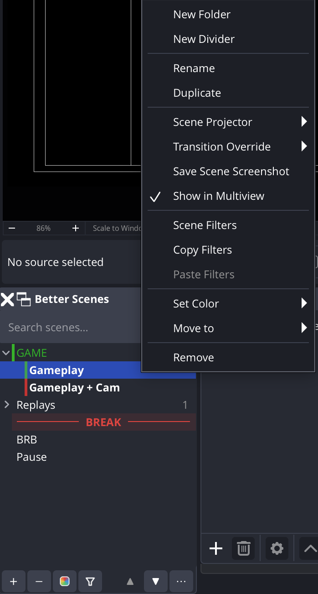

# Better Scenes Dock for OBS Studio

A drop-in replacement for the OBS scene list with the structure it has always
been missing: **nested folders**, **collapsible dividers** and **colors** for
scenes, folders and dividers.

<p align="center">
  
</p>

## Features

- Replaces the native Scenes dock with a tree view
- Click a scene to switch to it; in **Studio Mode** a click sets preview and a
  double-click transitions it to program
- Nested, collapsible **folders** with a scene-count badge
- Labeled **dividers** (lines with optional text)
- **Colors** for scenes, folders and dividers, with a preset palette picker
- Current program scene (red) / preview scene (green) indicators
- **Search box** to filter scenes with match highlighting (can be hidden via Options)
- Small **indicator dots** on scenes that have filters or a transition override
- **Keyboard shortcuts**: `F2` rename, `Delete` remove, `Ctrl+↑/↓` reorder
- Collapse all / Expand all, and the last selected scene is remembered across restarts
- Bottom **toolbar**: add (scene / folder / divider), remove, set color, open
  scene filters, reorder up/down, and an Options menu
- Full right-click **scene menu** matching the native dock: rename, duplicate
  (refs or full copies), scene projector (windowed / per-monitor fullscreen),
  transition override (with duration), save scene screenshot, show in multiview,
  copy/paste filters
- The dock order is **kept in sync with OBS' scene list**, so Multiview and
  other tools follow what you see
- Renaming a scene anywhere (even outside the dock) keeps its folder & color
- Structure persists per scene collection

## How it works

The dock renders a plugin-owned tree where scene entries reference real OBS
scenes by name. Folders and dividers are pure plugin metadata stored per scene
collection in the plugin's config directory. Switching scenes uses the official
OBS frontend API, and the native `scenesDock` is hidden on load so this dock
takes its place (you can bring the native one back from the Docks menu). The
flattened scene order is mirrored back into OBS' own scene list so Multiview and
anything else reading the scene order stays consistent with the dock.

## Installation

Requires **OBS Studio 32+**. Download the build for your platform from the
[Releases](https://github.com/paulloth1/obs-better-scenes-dock/releases) page,
then **fully quit and restart OBS** after installing. You'll find the
**Better Scenes** dock in OBS (re-add it from *Docks → Better Scenes* if needed).

### Windows

1. Download `better-scenes-dock-*-windows-x64.zip`.
2. Open `%APPDATA%\obs-studio\plugins\` (paste that into the File Explorer
   address bar; create the `plugins` folder if it doesn't exist).
3. Extract the zip and copy the `better-scenes-dock` folder into that
   `plugins` folder, so you end up with:

   ```
   %APPDATA%\obs-studio\plugins\better-scenes-dock\bin\64bit\better-scenes-dock.dll
   %APPDATA%\obs-studio\plugins\better-scenes-dock\data\
   ```

4. Restart OBS.

### Linux (Debian / Ubuntu)

For a system (apt/`.deb`) install of OBS:

```bash
sudo apt install ./better-scenes-dock-*-x86_64-linux-gnu.deb
```

This installs the plugin to `/usr/lib/x86_64-linux-gnu/obs-plugins/`. Restart OBS.

> **Flatpak OBS** uses a sandbox, so the `.deb` won't be picked up. Extract the
> plugin from the `.deb` and place it under
> `~/.var/app/com.obsproject.Studio/config/obs-studio/plugins/better-scenes-dock/`
> with `bin/64bit/better-scenes-dock.so` and the `data/` folder, then restart OBS.

### macOS

The build is **not notarized** (no paid Apple Developer account), so macOS will
warn the first time.

1. Download `better-scenes-dock-*-macos-universal.pkg`.
2. **Right-click the `.pkg` → Open** (don't double-click) and confirm, or after a
   blocked attempt allow it under *System Settings → Privacy & Security*.
3. Complete the installer, then restart OBS.

If you build from source instead, copy `better-scenes-dock.plugin` to
`~/Library/Application Support/obs-studio/plugins/`.

## Building

Official [obs-plugintemplate](https://github.com/obsproject/obs-plugintemplate)
layout for CI/releases; for fast local macOS iteration see [dev/README.md](dev/README.md).

## License

GPL-2.0-or-later — see [LICENSE](LICENSE).
